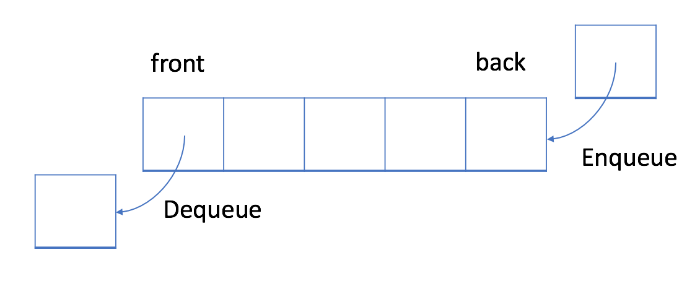

# C - 02 数据结构基础
> 你或许听过这句话——“算法 + 数据结构 = 程序”
>
> 是的，在计算机科学中，数据结构是计算机中存储、组织数据的方式，而正确的数据结构选择可以提高算法的效率。
>
> 在计算机程序设计的过程中，选择适当的数据结构是一项重要工作。许多大型系统的编写经验显示，程序设计的困难程度与最终成果的质量与表现，取决于是否选择了最适合的数据结构。
>
> C语言作为一门经典的编程语言，如何用其实现最适合解决问题的数据结构，也应是你所应当打下的基本功。
>
> 当然，即使你尚未接触过也不必紧张，这一部分选取的几个基础结构，也只是希望能让你对数据结构留下一点印象，更深入的部分今后也会在课内课外多有涉及，记得好好磨练哦~
>
> 如果你觉得没时间做完也没关系，在相应的节点提交相应的任务也是可以的

> **注：你只需要在以下三个部分中选择一部分完成即可，有兴趣的同学可以把另外两部分的题目当作拓展哦**

## Part 1 链表
### Step 0 内存管理
#### 题目描述

1. 请问运行Test 函数会有什么样的结果？
```c
char* GetMemory(void) 
{
        char p[] = "hello world";
        return p;
}
void Test(void) 
{
        char* str = NULL;
        str = GetMemory();
        printf(str);
}
```

2. 发现问题后我们进行了如下修改，请问此时再运行Test函数又会有什么样的结果？
```c
void GetMemory(char* p) 
{
        p = (char*)malloc(100);
}
void Test(void) 
{
        char* str = NULL;
        GetMemory(str);
        strcpy(str, "hello world");
        printf(str);
}
```

3. 但是你发现仍然存在问题，那应该如何修改呢？

#### 题目要求

提交对第一、第二两步运行结果的分析，以及你修改后可以达到目的的版本。

#### Tips

- 指针的理解 

- 函数返回的理解 
- C语言内存管理 

### Step 1 链表实现
#### 题目描述
> 当了解过内存管理相关的知识后，似乎我们可以将计算机零散的储存空间看作一个庞大的储物柜。
>  
> 从外表上看，这整齐排列的一排排储物柜似乎没有任何区别，但是每一小格的编号是完全独立的。
>  
> 这个时候，你想要在其中找到一格装有目标物的格子，而你恰好得到了一张纸条，上面写有一个格子的编号。当你按照编号打开格子，遗憾的发现格子里并不是你想要的东西，但幸运的是，里面还有一张附有编号的纸条.....这样找下去，你最终成功的找到了目标所在的那格、
>  
> 而将你寻找过程所打开的格子按照先后顺序连起来，就是在庞杂无章的储物柜里串连起的一条线索表。
>  
> C语言中恰好就有类似的封装、操作这种格子以及操作所谓格子所在地址的技术，而这样一条线索表也可以类比我们马上要接触的链表。


假设学校举办了一场个人竞赛，校方需要记录个人的姓名与竞赛得分，你需要用链表帮 助校方完成这件事。你需要依据程序框架实现链表的创建，节点插入，节点查找， 节点删除，遍历打印等基本功能。

```c
#include<stdio.h>
#include<stdlib.h>
#include<string.h>
#define NAME 12

typedef struct Node{
 char name[NAME]; //姓名
 int score;       //分数
 struct Node* next;
}Linked_List_Node;

typedef struct{
 Linked_List_Node* head;
 int length;
}Linked_List;

//待完成的函数
Linked_List_Node* linked_list_node_construct(char name[],int score);
Linked_List* linked_list_consctruct();
void add_node_to_head(Linked_List* linkedList,Linked_List_Node* node);
void add_node_to_bottom(Linked_List* linkedList,Linked_List_Node* node);
void delete_linked_list_node(Linked_List* linkedList,Linked_List_Node node);
void delete_linked_list_node_by_name(Linked_List* linkedList,char name[]);
void print_linked_list_nodes(Linked_List* linkedList);

/*
**输入:姓名name与成绩score
**输出:构造完的链表节点的指针
**函数作用:通过姓名和成绩构造一个链表节点
*/
Linked_List_Node* linked_list_node_construct(char name[],int score){
}

/*
**输入:无
**输出:初始化头指针与长度的链表指针
**函数作用:返回一个已经初始化头指针与长度的链表指针
*/
Linked_List* linked_list_consctruct(){
}

/*
**输入:指向链表的指针linkedList和指向链表节点的指针node
**输出:无
**函数作用:通过头插法的方式将一个节点插入到链表之中
*/
void add_node_to_head(Linked_List* linkedList,Linked_List_Node* node){
}

/*
**输入:指向链表的指针linkedList和指向链表节点的指针node
**输出:无
**函数作用:通过尾差法的方式将一个节点插入到链表之中
*/
void add_node_to_bottom(Linked_List* linkedList,Linked_List_Node* node){
}

/*
**输入:指向链表的指针linkedList和姓名name
**输出:无
**函数作用:删除链表中队名与给定队名一致的节点
*/
void delete_linked_list_node_by_name(Linked_List* linkedList,char name[]){
}

/*
**输入:指向链表的指针linkedList
**输出:无
**函数作用:遍历链表，打印每位支队伍的队名以及得分
*/
void print_linked_list_nodes(Linked_List* linkedList){
}

/*

**调试你的程序，要求如下:
**构造一个空链表
**插入4个链表节点，分别是: (name:Jack score:77),(name:Alice score:82),(name:Joseph score:90),(name:Tom score:65)
**遍历一遍链表，打印所有的节点信息
**删除姓名为ha所对应的节点
**重新遍历一遍链表，打印所有的节点信息
*/
int main(){
}
```
#### 题目要求
提交正确编写可执行代码及运行截图，给出必要的注释说明。（不一定按照给出的框架来写，只要能完成指定的功能即可）
#### Tips

-  结构体的理解 
-  C语言函数的知识 
-  C语言单向链表的理解 
-  C语言指针的理解 

## Part 2  队列
### Step 0 初识队列
首先，我们来接触一下队列这种数据结构。
就好像是工厂里运作的流水线，先放在履带上的产品总是最先到达终点，而后放上去的产品永远不会跑在先放上去的前面。
队列（Queue）是一种先进先出（FIFO，First-In-First-Out）的线性表，且只允许在后端（称为 `rear`）进行插入操作，在前端（称为 `front`）进行删除操作。

正如上图，在这种数据结构中，你将首先处理添加到队列中的第一个元素。
而就操作来说，插入（insert）操作也称作入队（enqueue），新元素始终被添加在队列的末尾。 删除（delete）操作也被称为出队（dequeue)。 同时你只能移除第一个元素。

### Step 1 实现队列
> 在这一步，我们用队列来简单的解决一下问题

#### 题目描述
给定一个字符串 `s`，请你找到它的第一个不重复的字符_，_并返回它的索引 。如果不存在，则返回 `-1` 。
例如：
**输入:** s = "leetcode"
**输出:** 0
**输入:** s = "loveleetcode"
**输出:** 2
**输入:** s = "aabb"
**输出:** -1
```c
int firstUniqChar(char * s){
}
```

#### 题目要求

-  完成待补充的函数并能实现指定功能，再编写完整的程序自己调用该函数，可以自己任意给出几个输入运行。 
-  提交正确编写可执行代码及运行截图，要求使用队列实现功能。 
-  你可以认为s中只包含小写字母 

#### Tips

- 了解一下队列的基本操作以及用C语言的实现方式

## Part 3 栈
### Step 0 初识栈
接下来，我们再来认识一下同样被广泛应用的栈结构。
和队列相似，栈同样是一种限制操作的线性表，但与队列不同的是，栈是一个 LIFO 数据结构。
通常，插入操作在栈中被称作入栈 push 。与队列类似，总是在堆栈的末尾添加一个新元素。但是，删除操作，退栈 pop ，将始终删除队列中相对于它的最后一个元素。
在这种被称为 LIFO 数据结构中，将`首先处理添加到队列`中的`最新元素`。


### Step 1 实现栈

> 接下来，我们也用浅浅地用栈结构来解决一个简单的问题

#### 题目描述
你现在是一场采用特殊赛制棒球比赛的记录员。这场比赛由若干回合组成，过去几回合的得分可能会影响以后几回合的得分。
比赛开始时，记录是空白的。你会得到一个记录操作的字符串列表 ops，其中 ops[i] 是你需要记录的第 i 项操作，ops 遵循下述规则：
整数 x - 表示本回合新获得分数 x
"+" - 表示本回合新获得的得分是前两次得分的总和。题目数据保证记录此操作时前面总是存在两个有效的分数。
"D" - 表示本回合新获得的得分是前一次得分的两倍。题目数据保证记录此操作时前面总是存在一个有效的分数。
"C" - 表示前一次得分无效，将其从记录中移除。题目数据保证记录此操作时前面总是存在一个有效的分数。
请你返回记录中所有得分的总和。
例如：

> 输入：ops = ["5","2","C","D","+"]
> 输出：30
> 解释：
> "5" - 记录加 5 ，记录现在是 [5]
> "2" - 记录加 2 ，记录现在是 [5, 2]
> "C" - 使前一次得分的记录无效并将其移除，记录现在是 [5].
> "D" - 记录加 2 * 5 = 10 ，记录现在是 [5, 10].
> "+" - 记录加 5 + 10 = 15 ，记录现在是 [5, 10, 15].
> 所有得分的总和 5 + 10 + 15 = 30
> 输入：ops = ["5","-2","4","C","D","9","+","+"]
> 输出：27
> 解释：
> "5" - 记录加 5 ，记录现在是 [5]
> "-2" - 记录加 -2 ，记录现在是 [5, -2]
> "4" - 记录加 4 ，记录现在是 [5, -2, 4]
> "C" - 使前一次得分的记录无效并将其移除，记录现在是 [5, -2]
> "D" - 记录加 2 * -2 = -4 ，记录现在是 [5, -2, -4]
> "9" - 记录加 9 ，记录现在是 [5, -2, -4, 9]
> "+" - 记录加 -4 + 9 = 5 ，记录现在是 [5, -2, -4, 9, 5]
> "+" - 记录加 9 + 5 = 14 ，记录现在是 [5, -2, -4, 9, 5, 14]
> 所有得分的总和 5 + -2 + -4 + 9 + 5 + 14 = 27

这里给出栈的基本操作及实现，即你可以认为以下内容已被包含至你所引入的头文件，其中定义的结构体、函数等可以直接调用，而你只需要完成calPoints函数的功能即可
```c
//定义一个栈
typedef struct Stack
{
        int *data;//连续的数据存储区
        int top;//栈顶指针（实际为指针下标）
        int size;//栈的大小
}Stack;

//初始化栈
Stack *Init(int n)
{
        Stack *s = (Stack *)malloc(sizeof(Stack));//申请栈的内存空间,并将空间的地址传给栈数据类型的指针.
        s->data = (int *)malloc(sizeof(int)*n);//开辟栈的数据区
        s->size = n;//栈的大小为n
        s->top = -1;//由于数组的下标从0开始，所以将栈顶指针初始成-1
        return s;//返回初始话栈的地址
}

//判断栈是否为空
int Empty(Stack *s)
{
        return s->top == -1;//如果栈为空，栈顶为-1
}

//返回栈顶元素
int Top(Stack *s)
{
        if (Empty(s))//判断栈是否为空
                return 0;
        return s->data[s->top];//返回栈顶元素
}

//入栈操作
int Push(Stack *s, int val)
{
        if (s == NULL)//判断栈是否存在
                return 0;
        if (s->top + 1 == s->size)//当栈顶指针等于栈的大小时，栈已满无法入栈
                return 0;
        s->top+= 1;//栈顶指针加1
        s->data[s->top]=val;//将栈顶元素插入栈顶空间
        return 1;
}

//出栈操作
int  Pop(Stack *s)
{
        if (s == NULL)//判断栈是否存在
                return 0;
        if (Empty(s))//判断栈内是否为空
                return 0;
        s->top -= 1;//栈顶指针向下移动
        return 1;
}

//待完成的函数
int calPoints(char ** ops, int opsSize){

}
```
#### 题目要求

-  完成calPoints函数的功能，并提交你的代码，同时附上必要的注释。 
-  谈谈你对问题的分析过程，以及如何利用栈的特性来简化问题（处理问题）。 
-  聊聊你对栈与队列的理解。 

#### Tips

- 了解栈的基本操作及实现方式

## 题目要求

- 正确的可执行的代码
- 回答题目中的问题时，可以结合图片表达自己的想法
- 良好的代码习惯（加分项）
- 代码运行的截图

## **本题提交方式**

> 收件邮箱：[glimmer401@outlook.com](mailto:glimmer401@outlook.com)
>
> 主题格式： 学号-姓名-考核-C-02
>
> 主题示例：2022090101012-张三-考核-C-02

## **出题人联系方式**
> QQ：2476221568
>
> 邮箱：2476221568[@qq.com ](/qq.com ) 

