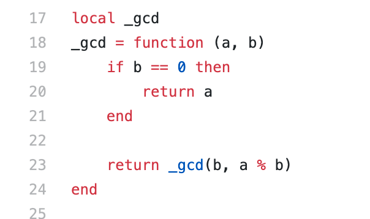

# Java方向-04: tk_sky要当大嗨阔

> `难度系数`：简单
>  
> 本题是一题小杂烩，对JavaSE上一些常用但很多人会忽略的技术和特性做一些补完。
>  
> 主要涉及内容：异常处理，IO，泛型，序列化，流


## Part 1. 叔叔可高兴了

> 那是个普通的暑假，tk_sky正在普通的刷着普通的b站，忽然b站崩了。tk_sky心想，我也要成为能把b站整崩的大嗨阔！


今年七月，b站发布了解释去年b站崩溃的技术解释：[2021.07.13 我们是这样崩的 - 哔哩哔哩 (bilibili.com)](https://www.bilibili.com/read/cv17521097)

主要原理是Lua作为一门动态类型的语言，将字符串类"0"在gcd运算时产生NaN，导致代码产生死循环。



以上是求gcd（最大公因数）的辗转相除法，也是导致b站崩溃的代码。

tk_sky看了这篇文章，作为要整崩b站的大嗨阔，他决定用他会的Java复现这个问题，为他以后整崩b站做铺垫。

首先他模仿上面的Lua代码编写了如下的Java版本：

```java
static int _gcd1(int a, int b){
        if(b==0) return a;
        return _gcd1(b,a%b);
    }
```

然后这样调用他：

```java
System.out.println(_gcd1("0",8));
```

> 这里"0"是为了模仿导致b站崩溃的意料之外的输入


他信心满满的编译，结果编译器却把他拒之门外：

```java
java: 不兼容的类型: java.lang.String无法转换为int
```

Java可恶的非动态类型编译器把他惹怒了。他决定使用他刚学会的Object类的知识解决掉报错：

```java
static Object _gcd2(Object a, Object b){
        if((Integer)b==0) return a;
        return _gcd2(b,(Integer)a%(Integer)b);
    }
```

报错没有了，运行！结果..

```
Exception in thread "main" java.lang.ClassCastException: class java.lang.String cannot be cast to class java.lang.Integer
```

### Task 1.

请你帮助tk_sky“解决”（忽略）这个异常让程序顺利的跑下去，跑出一个死循环（这里表现为爆栈）吧！

> 回答要求：
>  
> 1. 学习Java的异常（Exception）相关知识，学习try/catch关键字的使用方法，改进上面的_gcd2函数，捕获该异常，使程序用null替换相关异常参数继续跑下去，从而模仿b站崩溃的效果，产生死循环（爆栈）结果。将代码和爆栈（StackOverflowError）的截图附在题解里。
> 2. 编译运行使用`_gcd1`的代码产生的错误和编译运行使用`_gcd2`的代码产生的错误一样吗？讲讲编译时的错误和运行时的异常的区别。
> 3. 为什么`_gcd2`产生的异常叫"Exception"，而爆栈时产生的异常叫“Error”？它们有什么区别？


### Task 2.

作为一名有责任感的大嗨阔，tk_sky决定为叔叔在改进后的_gcd2代码里新增一个自定义异常`MyIllegalInputException`，在有非法输入时抛出给函数的使用者，提醒叔叔处理异常。

> 回答要求：
>  
> 1. 学习如何自定义异常类型，然后完成tk_sky要求的自定义异常。这个异常类应该能在出现异常时保存下非法输入的对象（Object类型），然后提供方法使处理异常的程序能get到它。
> 2. 学习异常的throw相关知识，使得改进后的`_gcd2`方法在出现非法输入（如`“0”`）时能抛出你自定义的异常。然后在调用他的main方法处catch它，使用异常的`printStackTrace()`方法将异常打印出来。在题解上附上你的代码和打印出异常的截图。
> 

> 打印出的效果应该如下：
>  

```java
MyIllegalInputException
	at gcd._gcd2(gcd.java:26)
	at gcd.main(gcd.java:48)
```

## Part 2. 怎么想都进不去吧

作为大嗨阔，tk_sky收藏了来自各种奇怪小网站的各种类型的数据，他用一堆不同类型的数组（数组，不是List）来储存它们。他想写一个方法，能够打印出他收藏的各种类型的数组中的数据，向别人炫耀自己的嗨阔技术。可是类型这么多，他定义的方法怎么想都进不去吧？

### Task 3.

学习泛型的知识，完成泛型方法`printArray`，使其能够打印各种类型的数组。

> 回答要求：
>  
> 1. 完成代码，附在题解上。
> 2. 如果tk_sky的数据使用List保存，又可以怎么写呢？学习并使用类型通配符完成代码。


### Task 4.

学习泛型类，完成一个泛型类`SecretBox`，使得tk_sky以后可以把任意类型的数据存在一个`SecretBox`实例中，收纳整齐。

> 回答要求：
>  
> 1. 完成代码，包括基本的get、add等方法，附在题解上。
> 2. 尝试生成一个该泛型类的实例，并向其中添加、取得任意类型的数据。

## Part 3. `#include <iostream>`

所谓嗨阔，不会将数据只存一份。现在tk_sky手上有储存了机密数据的某种类的实例，他希望把这个实例连带数据转移到另一台计算机上。可是他既不会网络编程也不会数据库，只好求助你了。

### Task 5.

序列化是一种将对象转换成字节序列的表示方法，反序列化是它的相反过程。请你完成序列化和反序列化程序，使其能够输出序列化到文件、从文件读取并反序列化。

> 回答需求：
>  
> 1.  涉及文件输入输出，我们不可避免需要用到流（Stream）、文件（File)和IO的知识。请学习相关内容，谈谈你对数据流的理解。 
> 2.  学习java的`ObjectInputStream` 和 `ObjectOutputStream`类，完成上述代码要求。 
> 3.  （选做）JSON是一种独立于语言的文本数据交换格式，多种语言都支持这种快速、易读的格式，在工程中我们也常用到JSON。
学习JSON相关知识，学习调用第三方库（如fastjson等），利用JSON完成上面的任务。 


---

## 本题题解要求

- 认真完成每个Task下的回答要求，记录你的做题过程，遇到的问题和解决方法等，配以必要的截图和说明；
- 用自己的理解回答问题，可以不完全理解知识点，但一定不要照抄网上资料，不得抄袭代码。

## 需要掌握的知识点

- java异常处理
- java泛型
- 流，IO，文件
- 对象的序列化

## Tip

- 善用搜索引擎

## 本题提交方式

> 收件邮箱：glimmer401[@outlook.com ](/outlook.com ) 
>  
> 主题格式： 学号-姓名-考核-Java-04
>  
> 主题示例：2022090901012-张三-考核-Java-04


## 出题者联系方式

> tk_sky
>  
> QQ：2071594767
>  
> 邮箱：linhanyuan_km[@163.com ](/163.com ) 

