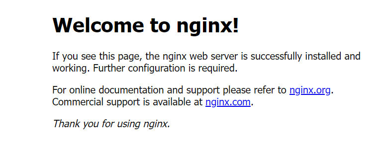

# 后端-04：Nginx
> 难度系数：普通
>
> Nginx是从头到尾完全用C语言写成的⾼性能的HTTP和反向代理web服务器，能代理网络用户去取得网络信息。它配置简单、扩展性强，也具有非常好的并发处理能力和高可靠性。让我们认识一下nginx吧！

## Task 1

- 在你的电脑上（系统不限）部署好一个nginx服务器（版本不限），成功看到如下页面😉



- 创建一个文本文件，复制如下内容，并且命名为myLocalhost.html
```html
<!doctype html>
<html> <head><title>MyLocalhost</title></head>
 <body>
 <div>
             
 <h1>127.0.0.1</h1>
 <h1>localhost</h1>
                     
 <h2><font color="blue">There is no place like 127.0.0.1</font></h2>
 </div>
 </body>
</html>
```

	- 将这个草率的静态页面部署到你的nginx上，尝试用浏览器访问到📹
	- 简单说说127.0.0.1究竟是什么？
- 试着在其他设备访问你的网站
	- 找一个局域网内的小伙伴（或者用你的手机在同一个Wi-Fi）访问下，看看能不能访问到你的页面
	- 找一个不在局域网内的小伙伴（或者用你的手机使用流量📱）访问下，看看能不能访问到你的页面
	- 讲讲为什么会这样


## Task 2：反向代理与重定向
在做这部分之前，为了更好的模拟nginx是放在服务器上的场景，你需要做如下改动：
> 打开hosts这个文件
> 
> （windows: C:\Windows\System32\drivers\etc\hosts，linux:/etc/hosts，mac：/etc/hosts）
> 
> 在hosts文件里插入如下几条记录：

```html
127.0.0.1 glimmer401.uestc

127.0.0.1 recruit.glimmer
```
要求：

- 试着用nginx的反向代理 ，实现如下效果：当你在浏览器中访问 [http://glimmer401.uestc](http://glimmer.uestc) 的时候，能看到正题里你写的那个页面🎠
- 试着用重定向，当你在浏览器中访问 [http://recruit.glimmer](http://recruit.glimmer.uestc)的时候，能重定向访问到工作室官网😵
- 简单说说反向代理与重定向的区别


## Task 3：你了解状态码吗？🔢
> 当你看到神秘数字404，403，500，200...的时候，你真的了解它们吗？

1. 了解一下常见的状态码的含义，哪些是请求错误？哪些是服务器错误？
2. 在之前的Task中你应该已经见过404了吧，让我们也来见见403吧！要求：
   - 使用**正则表达式**，要求匹配它的location满足：
      - 以start或begin开头，以glimmer结尾，且在中间的每一个字符都是非数字字符
   - 满足正则表达式的请求，则返回403状态码（通过封禁IP🚫，不能直接return状态码值）
   - 否则则返回如下图一行404的相关信息（这是什么？什么是json？）


## 拓展任务

> 你了解过nginx的日志吗？看看你的access.log吧📔📖


1. 在nginx.conf文件中找到上图的内容，了解一下这些奇怪的字符串都是什么吧
2. 先了解一下**awk**是什么，试试找出日志中所有出现过的IP和它们访问的url。
3. **（选做）**如果完成了第一题拓展选做的友友，可以根据你的日志记录，使**Task 3**的IP封禁更进一步，实现一个简单的IP自动封禁🔞。

**要求**

- 写一个shell脚本：假如我们将每分钟访问90次以上的IP定义为需要封禁的恶意IP，将得到的恶意IP定向写入黑名单文件blacklist.conf中，配置nginx，使得该IP被封禁。这个shell脚本每分钟自动执行一次。
- 一点思路，你可以一步一步地完成：
   - 找出当前这一分钟内日志记录下的所有IP
   - 统计每个IP的访问次数（看看uniq命令），再将超过90次的恶意IP定向输入到黑名单中
   - 用crontab定时执行🥳

## 回答要求

- 以文字和截图的形式记录你的完整做题过程
- 需要修改配置文件的Task，请截图提交你修改后的配置文件
- 完成本题过程中你遇到了什么困难，你是怎么解决的？


## 需要掌握的知识点

- nginx配置方法
- 一些网络常见状态码的了解
- nginx的简单日志分析


## Tips

- 善用搜索引擎！
- 善用搜索引擎！！
- 善用搜索引擎！！！


## 本题提交方式
> 收件邮箱：[glimmer401@outlook.com](mailto:glimmer401@outlook.com)
> 
> 主题格式：学号-姓名-考核-后端-04
> 
> 主题示例：202209090101-大佬-考核-后端-04

## 出题者Q&A方式

> QQ：1216754835
>
> 邮箱：[1216754835@qq.com](mailto:1216754835@qq.com)

