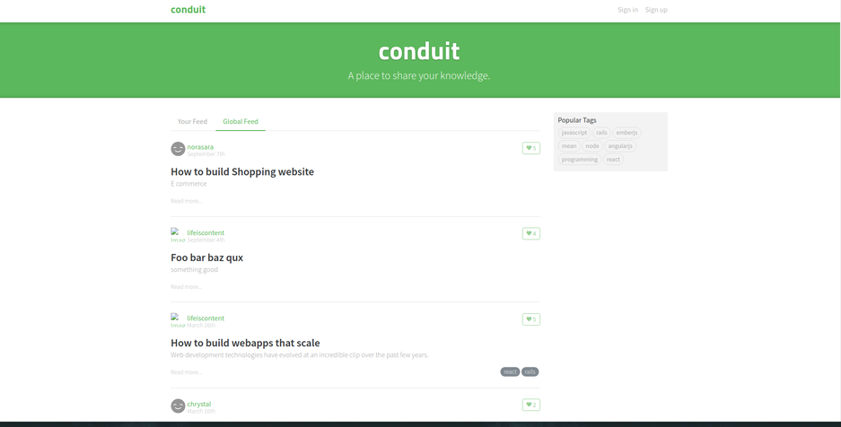
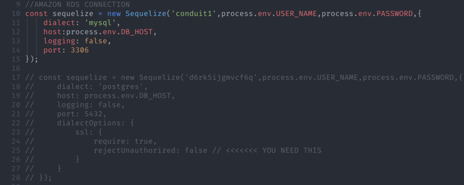

# 后端-05：我超，Docker！


> `难度系数`：一般
>  
> 在前面的学习中，相信你已经完全了解了虚拟机是一个如何伟大的创造，但是就连这么一个伟大的技术，也难免有许多不足。虚拟机依赖专有的OS，而OS无疑会占用额外的CPU、RAM等本可以用于运行更多应用的资源，同时虚拟机还有着启动慢、可移植性差的缺点。为了解决这些问题，容器模型出现了，下面让我们简单的体验一下让容器被大众所接受的首要功臣—Docker！


本题目会综合后端方向其他题目的部分知识点，还请按顺序做题

## 无知时了解Docker 😠

1.  在这里你将学习Docker的基本操作命令 
   -  在你的Linux下安装Docker并配置镜像加速。 
   -  了解镜像(image)和容器(container)的概念，拉取一个Ubuntu镜像并根据这个镜像创建一个容器，同时进入他的shell交互界面，你可以在这里试试你在后端01和后端02学到的东西，简单描述一下这个Ubuntu跟你的宿主机有什么区别？ 
   -  退出该容器，但保留该容器的进程，然后再根据镜像创建一个容器，但不进入该容器。 
   -  查看运行的所有容器，停止其中的一个然后重启他，完成之后删除所有的容器 
2.  在这里你将学习Docker网络 
   - 创建一个名为localnet的桥接网络
   - 创建一个名为c1的容器(不配置网络)，创建名为c2，接入localnet桥接网络，通过inspect指令确认c2是否成功接入
   - 创建一个名为c3的容器，同样接入localnet桥接网络，进入shell交互界面，尝试能否ping通c1和c2，并据此解释Docker网络

## 懂事时理解Docker 😐

1. 在这里你将学会如何使用dockerfile订制自己的镜像 
   - 先看一下一个简单的[实例](https://github.com/Tvanil/Example)吧，你将在下面的步骤中中完成一个类似的项目。
   - 根据上面的dockerfile，学习如何构建自己的镜像。运用你在后端04学到的nginx相关知识部署一个静态网站，并将它打包成一个镜像。要求通过镜像构建容器并运行之后可以通过指定端口访问到你写的html文件。请将构建镜像所需要的所有文件打包上传到自己的github，并在提交时附带仓库地址
2. 在这里你将学习如何将数据持久化 
   - 创建一个名为Baccano的容器并进入到其shell中
   - 创建一个名为Helloworld文件，并向其随意写入一点东西
   - 退出容器，在宿主机找到并查看该文件
   - 删除Baccano容器，你的helloworld还在吗？学习一下docker的数据存储方式
   - 重复上述操作，但是试着实现在删除容器后，你写的文件依然保留，可以用不同的方式完成

## 成熟时使用Docker 😋

最后一个任务需要我们使用 Docker 完成一个完整 Web 应用的部署，我们要自己构建部署一个叫做 Conduit 的网站，一个简单的能够注册登陆发帖的网站，点[这里](https://realworld.vercel.app/)可以体验一下一个已经部署好的 demo。



这是一个前后端分离的项目，在这个项目的[主页](https://codebase.show/projects/realworld?category=frontend)上前后端都有不同语言不同框架实现的 demo。

### 后端部分

后端我们选[这个](https://github.com/Varun-Hegde/Conduit_NodeJS)用 Node.js 写的项目（用这个项目数据库配置要方便一点。。。），所以构建时需要有 Node.js 环境和 npm。

- 首先要做的是创建一个 MySQL 的容器，并创建一个名为 `conduit1` 的数据库，以配合后端使用。
- 之后将后端项目 `git clone` 到本地，修改里面 `dbConnection.js` 文件当中的数据库连接相关配置，按照下图注释和反注释掉相应行。聪明的小伙伴一定可以从代码中看出，我们需要通过 `USER_NAME PASSWORD DB_HOST` 这三个**环境变量**将我们数据库的用户名、密码以及地址传给后端



- 之后执行 `npm install`安装相应依赖，完毕之后执行 `npm start` 即可开启后端服务器
- 根据上述构建教程，编写 `Dockerfile`，最终打包成 `realserver` 镜像

### 前端部分

前端我们选用[这个](https://github.com/khaledosman/react-redux-realworld-example-app)项目，我们首先需要通过 npm 构建生成网站，再将其部署在 nginx 上。

- 同样我们先将项目 `git clone` 下来，之后执行 `npm install && npm run build`，然后我们会得到一个 `build` 文件夹，将里面的内容都部署在 nginx 上面
- 在 npm 构建阶段通过设置 `REACT_APP_BACKEND_URL="http://xxxx:xxxx/api"` 这个环境变量来指定后端 API 的地址
- 在 `Dockerfile` 里面需要同时包含 npm 构建和 nginx 配置两个阶段，打包成 `realclient` 镜像。你可能需要了解一下 Docker 镜像的**多阶段构建**

按照上面流程完成之后，你现在应该有类似下图所示的三个容器：


到现在一个完整 Web 应用的部署就已经完成了，试试看在浏览器里能不能正常使用（比如注册、登陆、发帖等功能）。

从上面的例子可以看到，一个完整的应用可能需要多个容器间互相配合，Docker 提供了一个叫做 Compose 的工具方便我们定义一个单独的 `docker-compose.yml` 模板文件，来组织多个相关联的容器。

接下来去学习一下 Docker Compose 的使用，将以上三个容器组织在单个`docker-compose.yml`文件里。最好自己在 GitHub 上建一个仓库，把相关文件存上去，让别人直接 `git clone` 后再 `docker-compose up` 就能直接体验到整个完整的应用。

本题提交的内容需要包括将自己的配置操作过程截图记录、遇到的不懂的知识的学习过程记录、以及含有最终可用的 `Dockerfile` 的 GitHub 仓库地址。

## 拓展部分

### Task1

聪明的你一定已经注意到了一个问题：为什么我在安装虚拟机时，Ubuntu系统又好几个g，然而Docker拉取的Ubuntu镜像却只有几百个m呢？为什么我在主机上安装的mysql、nginx以及tomcat等只有几个或是十几个m，Docker拉取的镜像却高达好几百m呢？为了解答上面的问题，我们必须要了解Docker镜像的结构。


请根据Docker镜像的结构特点，回答上面两个问题。

### Task2

如果你进行过c语言的学习，那么你一定对helloworld程序不陌生。

初学编程的小明熟练地创建一个名为HelloWorld.c的文件

```c
#include<stdio.h>

int main(){
	printf("Hello world!");
	return 0;	
}
```

然后编写了Dockerfile文件

```dockerfile
FROM gcc:latest
COPY HelloWorld.c .
RUN gcc -o HelloWorld HelloWorld.c
CMD ["./HelloWorld"]
```

并创建了镜像，一切都是那么顺利，除了......


一个你好世界竟然占用了1.27GB的空间！小明十分不理解，并向你求助

- 请解释为什么一个简单的程序占用了如此巨大的空间
- 请帮助小明将该镜像简化

## 需要掌握的知识点

- Docker镜像与容器
- Docker网络
- 卷与数据持久化
- 应用的容器化
- Docker Compose部署应用
- 镜像分层与多阶段构建

## Tips

-  遇到问题善用 Google 和 StackOverflow 
-  推荐两个学习 Docker 的教程：  
   - [一杯茶的时间，上手 Docker](https://tuture.co/2020/01/01/442cc8d/)
   - [Docker 从入门到实践](https://yeasy.gitbook.io/docker_practice/)

## 提交方式

> 收件邮箱：glimmer401[@outlook.com ](/outlook.com ) 
>  
> 主题格式：学号-姓名-考核-后端-05
>  
> 主题示例：2022090901011-小明-考核-后端-05


## 出题者Q&A方式

> QQ：1615504154
>  
> 邮箱：1615504154[@qq.com ](/qq.com ) 

