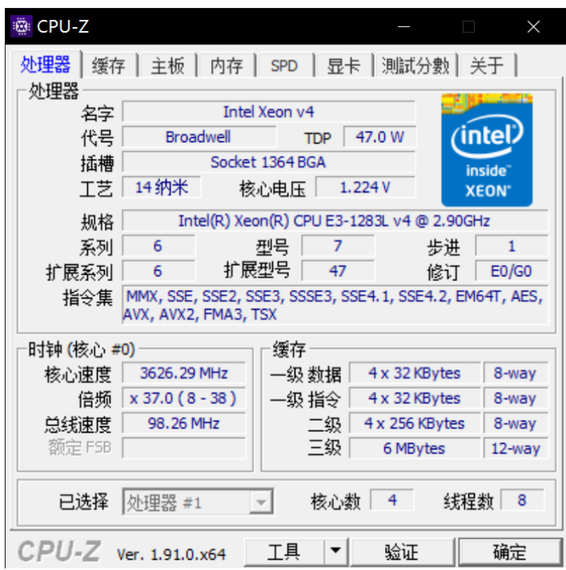
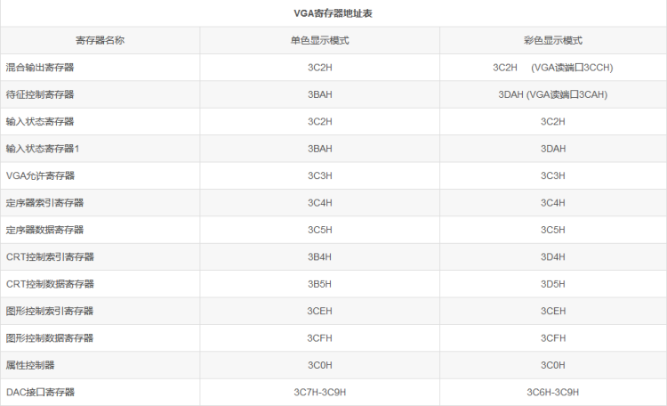
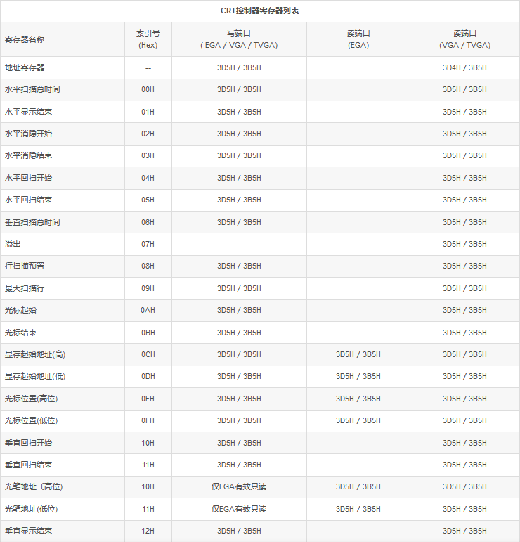

# C - 04 cache && hardware


> 不知道大伙看到这个题目有没有觉得：我们学软件的怎么还要去了解硬件呢？
> 
> 🤔会写程序不就够了嘛。我们和那些破修电脑的能比吗（bushi）。但就像数学的发展都是基于我们小学甚至幼儿园所学的1+1=2这样基础的运算而来，我们所学的软件，也是要基于硬件才能实现的。道理很简单，若数学上，1+1被要求等于3，那么如今的数学发展肯定截然不同。之于软件来说，如果硬件的设计是另一种方案，我们所用的语言，所写的软件，也完全有可能是另一幅情景，应用也会有天差地别。🎆啰里啰唆，就是想告诉大家，软件的实行是基于硬件之上的，而不是独立存在的，你所用的编程软件经过编译器等处理过后，最后都会转化成硬件的一步一步操作，如果硬件不支持某一样操作，那软件自然也不能考虑这样去执行。同时，很多语言的设计和其背后的原理，都与硬件息息相关（毕竟程序的执行最后是和硬件对接），我们去了解硬件，其实也是为了更好的去学习我们的语言，更好的掌握计算机这门博大精深的学科，对硬件知识的了解深入，反而能让你今后在今后的学习中更加如鱼得水。当然，大家别急，我们毕竟是写软件的，不用学习到会自己造硬件这种程度（-.-)，在本题乃至今后的学习中，更多的，我们会把硬件抽象出来研究与学习。😘
> 
> 大家刚进来，也不求大家能对所有硬件都有所涉及，可能会有点强人所难了。所以我们就挑几个部分来考核学习吧~

## Tips
本题看的内容会多一些，写的内容会少一些，知识上耦合性不高，希望写点东西的同学也可以自行跳到后面的part完成。（即，重点考核的提交部分为Part2的cache,其他部分知识也会纳入考核）
~~希望看到大家在题目中能有乐于思考的痕迹。百分百完成题目，很多大二学长们应该都做不到哦，希望大家不管做完与否都要提交哦，内，答应我，好嘛 )~~
## Part 0 来点简单的硬件
~~对硬件不怎么了解的小伙伴可以做一做~~
了解下电脑要能跑起来需要哪些部件了解下电脑的各个接口（内部：比如说下面的板子上这些插槽，外部：比如USB）康康这块10年前的主板有些什么接口
 


了解下南桥和北桥 下载一个CPU-Z，试着解读一下各项信息（比如CPU架构、内存频率等等） [cpu-z和GPU-z的下载](https://share.weiyun.com/2NgSuDdi)



## Part 0.5 IOIOIOIOIOIOIOIO


了解一下什么是实模式，什么是保护模式，它们之间的区别有些什么？例如两者之下的通用寄存器有什么区别？我们现在计算机主流采用什么模式呢？
为什么会有实模式和保护模式的区分呢？IPv4和IPv6有什么区别，IPv6之于IPv4格式上做了哪些扩充和改变？为什么计算机喜欢有这么繁琐的分类呢？

不知道大家有没有想过CPU如何操控硬件呢，这一节里想带大家认识一下IO这个概念。
IO是什么意思？IO设备指的是什么？~~那OI呢(OI爷！QAQ)~~
什么是IO接口？IO接口的意义是什么？对于CPU来说，IO接口相对于IO设备的这种"简化"是一种什么？尝试了解一下在IO接口与CPU之间是否有更加"简化"的设计存在，它(或者它们)的意义是什么？
什么是端口？那么IO端口呢？IO端口号和内存地址有什么共同点？
（选做，其实所有的题大家尽力就好）有没有其他硬件设计也采用了IO接口之于CPU与硬件这样的设计思想？说说这种思想是什么？（这种思想广泛的运用于计算机领域）

## Part 1 谁想在主机里烧焦？ 我！


​	不知道大家有没有看过那种我的世界（Minecraft）顶级材质包视频中斑斓色彩的画面，看着画面确实让人如痴如醉，但是却也让人不禁对其显卡感到同情与担心。或者大家平时有没有买了一款游戏却因为画质卡顿而无奈弃坑呢，反正我的办公本是经常碰到这种情况的，大镖客2还搁我电脑里躺着积灰呢(ಥ﹏ಥ)。这一节我想带大家简略认识一下显卡的机制（没吃过猪肉只能看猪跑了QAQ），大家别着急，写的内容会放在下一节，大家再忍一忍，多学点知识不吃亏的。
**什么是GPU?对比一下CPU与GPU的共通点？（CPU有大家熟知的内存，那么GPU呢)**

### 往显存里写点什么
本小节主要跟大家讲讲简单的文本怎么打印，从中更加深刻的了解显存，往显存里面写东西，我们要搞懂三个问题：写进去的是什么，往哪里写，怎么写进去？
#### 写了个啥啊？
如果大家是硬件设计师，会如何规范制定显存的显示单位呢，大家不妨谈一谈自己的看法。

了解一下显存的字符是怎么样作为数据传输的（文本模式哟），描述一下每个位都是什么含义，前景色与深景色都是什么意思？
**0x0747 0x076c 0x0769 0x076d 0x076d 0x0765 0x0772 是什么含义呢？**

#### 往哪儿写啊？

答案是光标，或许这个问题应该叫在屏幕上往哪里写p>.<q
**了解一下想要控制光标需要用到什么，采取怎样的操作。**
**惊，答案参考图竟流出（bushi），显存里面也有寄存器（Σ(っ °Д °;)っ），快去了解了解它们如何进行对显存和其相关设备的读写。**





**相信大家已经在网上博览群书，对显存寄存器有一定了解了，如果我想获取到光标的位置，应该怎么操作呢？（阐述大体的必要步骤就可以了）（怕大家绕进去提一嘴，h有它自己的含义-.-)**

#### 最後の質問，咋写进去啊？
本小节只涉及一点点简单的汇编知识，笔者绝对是因为相信大家的实力才只做了一点解析的，绝不是因为懒。


思来想去还是心疼一下各位学弟学妹们，给大家一点小tip,諸君如果有接触C03的内联汇编，应该发现这里的汇编格式怪怪的，建议大家了解一下AT&T与Intel之间的区别。

```
mov byte [gs:0x00],'1' 
mov byte [gs:0x01],0xA4 

mov byte [gs:0x02],' '
mov byte [gs:0x03],0xA4 

mov byte [gs:0x04],'M' 
mov byte [gs:0x05],0xA4 

mov byte [gs:0x06],'B' 
mov byte [gs:0x07],0xA4 

mov byte [gs:0x08],'R' 
mov byte [gs:0x09],0xA4 
;直接向缓存里面写入数据  


mov dx 0x03d4 
mov al, 0x0e 
out dx,al 
mov dx,0x03d5 
in al,dx 
mov ah,al ;先获得高八位

mov dx,0x03d4 
mov al,0x0f
out dx,al 
mov dx,0x03d5
in al,dx ;再获得低八位 
;获取显存的某些信息
```
## Part 2 再快点，再快点（这一部分建议阅读《CSAPP》第6章节）
缓存不知道大家了解过没有，但是内存大家一定知道吧，还有打开查看电脑信息，上面的C盘,D盘，它们都可以叫做缓存。缓存可以说是一项非常伟大的发明，在没有缓存的年代，电脑不能说是有点小卡吧，只能说是慢的见者落泪。后来随着时代的发展，缓存被开发出来，给电脑带来了次方级别的速度提升，你我的电脑，才能因此有流畅的体验。
### 来点基础缓存知识
什么是缓存？电脑中有哪些可以被视为缓存？
了解一下存储器的层次结构，L1,L2,L3,L4这些都是什么意思？它们的速度比较起来怎么样？它们都位于什么位置，或者有别称嘛？
了解一下硬盘长什么样子，磁道，盘面，柱面，扇区，转动臂，主轴都是什么东西？SRAM，DRAM这些都是什么？硬盘是缓存嘛？
### 看累了来动动手吧


此部分给大家一点引导性的问题，题目中也会适当给出一些参考内容，主要是给可能因为各种原因没有阅读CSAPP对应章节的同学的，笔者还是强烈建议大家去阅读CSAPP对应章节。作为C04的压轴题，这道题肯定是有一定难度的，希望大家不要灰心，努力把它拿下！
**缓存是如何设计运作的？**
例如：
每条信息的存储单位是怎样的? E b t都有什么含义？
缓存中信息满载了应该怎么办？
**如何读取文件？**
**了解一下getopt函数是怎样处理字符串的？**

### 本题，你要实现一个tiny cache，它需要满足缓存的以下功能：
### 可以自定义其大小结构；读取相应的目标文件并得到正确的输出。
（你可以提交尽管未完全完成的tiny cache,证明其功能采用输入文件的形式最好）
输入文件示例如下：
```
L 10,1 
M 20,1 
L 22,1 
S 18,1  
L 110,1 
L 210,1  
M 12,1 
```
每行格式如下：
```
operation address,size 
/*For operation,L denotes a data load,
S a data store,M a data modify
(a data store after a data load) For address,
it is denoted in hexadecimal terms.For size,1 byte per '1'*/
```

输出：
```
hits:4 misses:5 evictions:3
```
示例展示：
```
/* your teminal input: 
./tiny_cache -s 4 -E 1 -b 4 -t traces/yi.trace */
//output 
L 10,1 miss 
M 20,1 miss hit 
L 22,1 hit 
S 18,1 hit 
L 110,1 miss eviction 
L 210,1 miss eviction 
M 12,1 miss eviction hit 
hits:4 misses:5 evictions:3
```
tips:驱逐策略可以使用最简单的LRU策略；
整个的实现只是给大家一个参考，大家也可以适当进行让自己更有利的改变；
给大家2段代码作为参考文件，示例的代码段也可以参考，大家也可以自行设计：
```
//text 1 
L 10,4  
S 18,4 
L 20,4 
S 28,4 
S 50,4
```
```
//text 2 
L 0,1 
L 1,1 
L 2,1 
L 3,1 
S 4,1 
L 5,1 
S 6,1 
L 7,1 
S 8,1 
L 9,1 
S a,1 
L b,1 
S c,1 
L d,1 
S e,1
M f,1
```

## 结语
嫩牛啊，大家能坚持到最后，可喜可贺，可喜可贺！我知道这道题有yi点点又臭又长，但是我相信大家一定对硬件有了截然不同的了解与认识，相信在以后的学习中，肯定能很好的帮助到大家的，那么大家下题见~


## **题目要求**

- 正确的可执行的代码(主要为Part2你实现的tiny cache)
- 回答题目中的问题时，可以结合图片表达自己的想法
- 良好的代码习惯（加分项）
- 代码运行的截图


## **本题提交方式**
>收件邮箱：[glimmer401@outlook.com](mailto:glimmer401@outlook.com)
>
>主题格式： 学号-姓名-考核-C-04
>
>主题示例：2022090101012-张三-考核-C-04

## **出题人联系方式**
> QQ：1206370306
>
> 邮箱：1206370306@qq.com 

