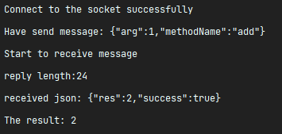

> `难度系数`：普通
>
> **实践拓展题 题目说明**
> RPC（Remote Procedure Call）即远程过程调用协议，通俗点的来讲便是通过网络调用其他计算机上的服务或方法，像调用本地方法一样调用网络上的其他方法。
>
> 做完了这么多题，你是否觉得Java的知识点比较散乱、难记？实践是检验真理的唯一标准。下面就利用前面题目的已学知识，动手实践，撸码完成一个rpc框架吧！
> 本题是为有充足时间和精力的同学提供的一个学习扩展题，供各位检验前面知识的掌握情况。不要求一定要完成，但完成后你一定能有所收获！  
>
> tip：该题中每一个part都是最后组装时所需要完成的，一般只需要完成最后的task即可，推荐先查看part5再进行做题。

## Part 1.反射调用

反射是java中比较常见的动态调用对象方法的功能，在我们的“自研”rpc框架中，我们将通过反射来调用对方所发送过来的请求。

### Task 1.简单的反射调用
这是一个示例类：
```java
class Apex{
    String name;
    String rank;

    public Apex() {};

    public Apex(String name, String rank) {
        this.name = name;
        this.rank = rank;
    };
        
    void rank(){
        System.out.println("You Died, pp - 1000");
    }

    Integer takeMyMoney(Integer yourMoney) {
        return yourMoney - 1000;
    }
} 
```

### Task 2.动态的反射调用

创建一个输入类，当你输入某个方法名，就调用该方法，举例

<br>
<br>输入了rank，程序通过反射调用该方法，实现了打印。
也可以做成一个字符串输入，而非scanner，在程序中输入某个字符串则进行反射调用（推荐，因为后面需要用到)。

### Task 3.更动态的反射调用

当自主创建多个类后，该如何实现调用不同类的方法，做到上方的输入后能调用相应的方法。
你需要思考：
如何去读取不同类？
如何读取类中是否拥有输入的方法？
如何输入参数？
如果不存在该方法，需要报错吗？
等等问题

## Part 2.方法注册
如果你是一个rpc的服务提供者，你需要选择性的将自己的方法提供出去作为服务，总不能将所有方法都暴露出去吧？（虽然说也不是不行，但是本题要求不行）

### Task 1.简单的注解
注解是java中非常常见且好用的功能，最常见的注解可能是你在重写父类方法时所会用到的@Overried，而该任务中，你需要自己编写自己的注解，注解作用对象可以是方法，也可以是对象。
例子：
```java
@GlimmerClass
class Glimmer{
    @GlimmerMethod
    void apex(){
        ...
    }
} 
```
你需要确定并编写两个注解，第一个注解为类上的注解（例如@GlimmerClass，名字随你自己取），第二个注解为方法上的注解（例如@GlimmerMethod）

### Task 2.反射查看注解
可以通过反射查看该类是否含有某个注解，或者将该类的所有注解暴露出来。

### Task 3.本地注册方法
请编写一段代码，它能够扫描该包下的所有class文件，找出其中带有特定类上注释（你自己定义的那个注解）的类，之后再接着扫描该类中的方法，若方法带有特定的注解（你自己定义的那个注解），记录它。
举个例子，这个demo里的add和shout方法都带有特定注解，它就被找出来了。
<br>
通过一个数据结构来记录类和对应的方法。
可适当贴些代码在回答中来做讲解，谈谈你所使用的数据结构，为什么要使用它？

## Part 3.通信
既然是远程方法调用，自然需要和其他主机进行远程连接吧？
由于是最简单的rpc，我们直接选择socket进行远程连接。

### Task 1.连接

请编写两段代码，一段代码A去连接8888端口，并能够发送一点东西。
另一段代码B监听8888端口，并把接收到的东西打印出来。
你可以选择将两个代码写在不同文件，通过跑两次的形式来完成，也可以用两个线程来跑。

### Task 2.回复
该任务只需要本地即可完成。
在上述代码的基础上，请让B代码在监听8888端口收到消息后，向代码A回复一段信息，你可以让A代码监听9999端口，然后B代码向9999端口回复消息，这是最简单能够完成的方式。

## Part 4.传输信息
A如果想调用B上的X方法，那么B总得知道A想调用哪个方法吧？并且如果该方法需要传参，那么还得把参数传过去，于是，双方需要协定如何传输数据。
我们这边使用最简单的数据交换格式：JSON，关于json请自行了解。

### Task 1.序列化
关于序列化，你可以选择：手动序列化为json，即自行编写字符串转化，将属性什么的都写死或者通过反射获取后再打印出来；或者通过一些序列化工具，例如jackson，fastjson等调用来序列化。

### Task 2.反序列化
当B接收到A所传来的json后，你可能需要将B传来的参数进行反序列化，该过程推荐使用序列化工具来进行，当然也可以阅读fastjson等开源工具的源码自己实现一个反序列化工具或者实现一个特定的反序列化工具（即仅针对该题而不考虑泛用性和性能）。

### Task 3.规定协议
虽然我们确定了使用json来实现数据交换格式，但是json毕竟只是传输参数时所用到的。
我们的通信协议中还需要用到其他东西，方法名该如何传输？{“method”：“rank”}吗？那就是全程使用json格式来传输数据了。
这就要靠你自己去思考和设计了，并且其中也可以添加其他东西，例如该方法优先级，自己的魔数，请求id等。
请附上自己的代码并相应的介绍自己所设计的协议，简要讲下每个参数的用处吧。

## Part 5.组装
当完成了以上的所有part后，就可以着手将这些代码融合起来了。
本题所要实现的简要rpc框架流程如下：
A--服务提供者，B--服务需求者
A中先将所有注释过的方法注册到自己的数据结构（由你自定义）中，并开始监听特定特定端口的socket连接，
B通过发送自定义协议的信息，将所要执行的方法和参数告诉给A，
A通过反射调用相应方法后，将执行结果回馈给B，这样B就完成了一次rpc调用。

示例图：

A:<br>


<br>B:<br>
<br>

### 本题题解要求

- 认真查看每个part中的task提示，记录你的做题过程，遇到的问题和解决方法等，配以必要的截图和说明；
- 用自己的理解回答问题，可以不完全理解知识点，但一定不要照抄网上资料，不得抄袭代码。
- 请将代码上传到github上并提供链接


### 需要掌握的知识点

- 面向对象编程思想
- 注解与反射
- socket通信
- 序列化与反序列化


## Part 6.拓展
该部分为拓展部分，做完上面的就可以提交了，感兴趣的可以继续往下做做。

### Task 1.Jar包的注册
在part1中，我们通过本地扫描class文件进行方法的注册，那么，如果我们想对jar包里的类和方法也进行注册呢？
编写一段代码，使其能够读取jar包中的类并进行注册。
进阶：
修改你的代码，使得它既能够读取jar包也能够读取本地class文件（也可以是简单的if else）。

### Task 2.配置文件（或注解配置）
在一般的项目开发中，我们都是将不同类型的文件放在不同的包中，而我们也可以将服务提供类放在特定的包中，通过配置文件的方式直接扫描特定的包即可。
例如socket连接的端口，socket连接的ip地址，我们都可以通过配置文件的方式类进行简单的修改。
如果你想使用配置文件的方式进行定义，推荐使用yaml文件来进行，并且你需要自己编写一个yaml文件的读取类进行配置信息的读取。
如果你想使用注解的方式来进行定义，那么你需要编写对应的配置类，在该配置类上编写相应的注解以使得其他代码能够获取。

### Task 3.代码解耦（即可复用）
你所编写的特定注释方法的注册，是否写死了寻找的注释？
你所编写的socket通信，是耦合在了主程序代码中，还是拆分出来，变成一个可复用的socket工具类？
你所编写的yaml文件读取类，是否写死了找寻的key？
如若是，那么可以尝试将他进行解耦，将这些拆分成不同的代码块，使得可以进行复用。
当然，性能上可能会有损失，所以本task可做可不做。

### Task 4.注册中心
在一般的rpc框架中，都有着注册中心来帮助进行服务发现和服务注册。
该task会大幅修改原有代码，请酌情考虑是否做该task。
简要介绍注册中心的作用：首先接收服务提供者的提供信息，将其保存在其本地内存中。
当消费者想要进行rpc调用时，将消息发送给注册中心，注册中心通过解析发送的内容，在本地存储中找寻该方法的所有服务提供者，并选择其中一个，读取出它的ip地址和端口，返回给消费者，消费者获得到该信息后，再与服务提供者进行连接。
注册中心还需要不断对服务提供者进行通信来确保其是否还能正常进行服务，如果该机下线，则需要在存储中将该机去除。
你需要做的事是：
1：
当服务提供者在本地注册了方法后，需要像注册中心发送相应的注册信息，包括自己的方法名，自己的主机名，ip地址端口号等，你需要将注册中心地址等信息写在配置文件中。
2：
当消费者想要进行rpc调用时，首先查找本地缓存是否拥有保存的服务提供者信息，如果没有，则需要向注册中心发送请求，并从注册中心获取到相应的ip地址和端口，之后再向该地址进行请求。如果该机子无法进行调用，则重新向注册中心获取信息。
3：
注册中心需要定时向服务提供者进行通信以确保服务提供者能够正常工作，如若不能则需要重新缓存。
4：
你需要注意该如何去定义通信时所发送的信息。

### Task 5.协议改进
[https://dubbo.apache.org/zh/docs/concepts/rpc-protocol/](https://dubbo.apache.org/zh/docs/concepts/rpc-protocol/)
这是dubbo官方的协议描述，你可以进行简单的查阅并与现在我们的协议进行对比（那肯定是先进多了），
你可以根据该协议进行思考，该如何进行协议的改进。
改变数据交换协议，不再用json进行数据传输？
或者还是基于json，但是由socket变成http？
可以进行一定的思考。

### Tip

- 善用搜索引擎


### 本题提交方式

> 收件邮箱：glimmer401[@outlook.com ](/outlook.com ) 
>  
> 主题格式： 学号-姓名-考核-Java-实践拓展
>  
> 主题示例：2022090901012-张三-考核-Java-实践拓展


### 出题者联系方式

> XiaFeng
> 
> QQ：1612188282

