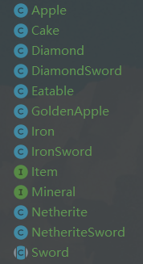

# Java方向-03：Minecraft Once More

> `难度系数`：简单..大概？
>  
> 本题接上题，继续学习Java面向对象的更多特性。
>  
> Minecraft（我的世界）是一个在00后中很出名（虽然过气了）的游戏，它就是使用Java开发的。作为工作室里一款流行的游戏，21年的Java招新题中使用了MC作为背景。~~因为我出不出题了~~ 为了复刻经典，让我们也来探索方块世界吧！
>  
> 本题是一个伪交互题。题目很长，但耐心、认真完成本题后，你将和出题人共同完成一个有意思的小项目，同时加深你对面向对象思想的理解！
>  
> p.s. 这题本质和mc没什么关系，没玩过也不影响做题（


## 庆云顶之弈

> 题目灵感 ICPC Nanjing 2021: Cloud Retainer's Game


书接上回。Lumine 和 Cloud Retainer 为了打发时间，决定在洞府里玩一款工作室流行联机的游戏Minecraft。可是原版游戏实在是太无聊了，她们马上就玩腻了。

热爱发明的 Cloud Retainer 提议，使用Java编写各种各样的类及其相应的属性和方法，模拟mc中的物品和生物的交互。 Cloud Retainer 将编写一些游戏机制和敌人类型，而 Lumine 则负责编写生存所需要的物品和生存的具体动作。最后把两人写的程序合二为一，看看 Lumine 能不能在虚拟的mc世界生存下去！

四处旅行的 Lumine 虽然见多识广，但Java什么的她还是不会写的。请你帮助她赢得这场模拟游戏！

## Part 1. I'll make some cake

> [点击解锁bgm](https://music.163.com/song?id=29819908)


对于每一个玩家，`生命值` 与 `饥饿值` 是两个非常重要的概念，只有让这两个值时刻>0才能生存下去。因此，Lumine打算设计各种各样的食物，让她能补充饥饿值与生命值。

由于她想设计很多很多种食物，包括但不限于蛋糕（回复5点）、苹果（回复2点）、金苹果（回复2点饥饿值、2点生命值）等。如果她每种食物都新建一个类，代码必然显得臃肿、复用性低，毕竟每种食物无非就只有“吃”一种行为，数量、回复的饥饿值等几个相似的属性。

有没有什么办法能提高作用相似的各种食物的代码复用性，使得懒人Lumine的代码更加简洁？

### Task 1.

> 注意！从本Task开始，请注意规范你的码风，不仅仅是变量命名规范之类，更要在面向对象的层次上注意代码的耦合度、复用性和可扩展性，尽量写出优雅、高质量的代码。
>  
> *本题建议使用jdk版本1.8以避免玄学错误


学习Java中类的继承机制，编写食物类`Eatable`作为基类，包含上面提到的基本属性（回复的饥饿值`hungerRecovery`，食物的数量`count`）和方法（吃）。然后再至少编写三个派生类（`Apple`、`Cake`、`GoldenApple`）继承食物类。注意需要为上述的各个类型都添加**构造方法**。

> 回答要求：
>  
> 注意，请创建并把本题的所有代码放在一个名叫`space.glimmer.lumine`的包里。
>  
> 完成上面的代码要求，将代码附在题解上。具体的方法行为可以print出来表示完成了。（e.g. ”通过吃东西回复了xx点饥饿值！“）
>  
> 简述你理解的类的继承是什么。Java为什么要引入继承这个机制？
>  
> 了解super关键字，讲讲他的作用。
>  
> 在mc中，金苹果是种特别的食物，吃掉他不仅可以获得饥饿值，还可以获得生命值。可是金苹果类已经继承了`Eatable`类的`eat`方法，有什么方法可以让金苹果类拥有不同的`eat`方法？
>  
> 讲讲什么是重写/重载，以及它们的作用。
>  
> （选做）了解下类之间的依赖、关联、聚合关系都是什么意思。


## Part 2. Creeper? Oh man!

> [点击解锁bgm](https://music.163.com/song?id=29819906)


想要杀死强大的怪物，就需要强大的武器。mc中武器有很多种，包括铁剑、钻石剑、下界合金剑等。和食物类似，Lumine 想为各种剑建一个`Sword`类。但是`Sword`类本身只是一个普通的类，也可以被“非法”地创建成实例，那就不符合游戏了。而且不同种剑的合成配方、攻击效果不同，如果又要写基类、又要每类重载，可能会让 Lumine 觉得很烦。

### Task 2.

`抽象类`是一种特殊的类。学习抽象类的基本概念，定义抽象类`Sword`，并为其添加抽象方法`void enchant()` （给剑附魔，调用后攻击力提升20%）。然后完成三个继承它的类（记得给剑加上double类的攻击力属性`power`）：`IronSword`（攻击力5）、`DiamondSword`（攻击力7）、`NetheriteSword`（攻击力8）。攻击力属性命名为`power`。

> 回答要求：
>  
> 完成上面的代码要求，将代码附在题解上。
>  
> 讲讲什么是抽象类，它和普通的类有什么区别，有什么作用。
>  
> 众所周知，下界合金剑NetheriteSword是基于钻石剑DiamondSword合成的。尝试让`NetheriteSword`既继承`Sword`又继承`DiamondSword`。发生了什么？为什么？


### Task 3.

现在有了武器，当然也要有怪物啦。Clound Retainer 设计了几种怪物，为了和你的程序交互，她使用了`接口(interface)`来规定你可以对怪物干的坏事：

```java
interface Monster{
    void attack();
    void runAway();
}
```

> Q1. 学习关于java的接口的知识，讲讲接口和抽象类有什么区别？接口有什么用处？


学习了接口，我们也帮Lumine给所有的物品定义一个吧。这样所有的物品都可以被物品栏统一管理了！

> Q2. 请创建一个空的`Item`接口（表示物品）、一个空的`Mineral`接口（表示该物品是矿物），然后让所有的物品类（如各种食物，各种武器等）实现`Item`接口，创建三个只有一个属性`count`（数量）的类：`Iron`（铁矿）、`Diamond`（钻石矿）、`Netherite`（下界合金），让它们实现`Mineral`接口，为后面和Clound Retainer的程序交互做准备。


> Q3. 可以让三种矿物既实现`Item`接口又实现`Mineral`接口吗？实现它。这和类的继承的此类特性有什么区别？


## Part 3. Take back the night

> [点击解锁bgm](https://music.163.com/song?id=412902660)


万事俱备，只欠东风！Clound Retainer已经完成她那边的程序啦，快完善下Lumine的程序，准备组合、开玩吧！

### Task 4.

首先检查你写的代码是否已经完成了Cloud Retainer要求的所有内容：



完成后，在下面的链接下载Clound Retainer的程序，把两个文件和你的代码一起导入到`space.glimmer.lumine`包内：

[https://github.com/tksky1/GlimmerJavaRecruitment](https://github.com/tksky1/GlimmerJavaRecruitment)  (github的使用请参考日常基础)
> 如果实在上不去也可以去 [tk_sky的ftp小站](http://ftp.mcyou.cc) 下载


看看有没有报错，有报错多半是你的代码没按前面的要求完成。请确保你写的类的各种属性不是private，使得Cloud Retainer的程序能够访问。

> Quest 1. 阅读Clound Retainer写的代码，大概明白整个游戏的结构和实现方法。下面这张图可以帮你更好地理解：


> Quest 2. 把报错干掉以后，修改你之前写的各类食物的`eat()`方法，让吃东西的操作能够实际地修改到player的健康值和饥饿值。


好了，现在你得到了一套完整限量典藏白金版的`《Minecraft：Clound Retainer Version》`游戏！在`Game.java`中找到Player类的play()方法，编写游玩代码，然后运行`Game.java`赢得这个生存游戏的胜利吧！

> Tips. 你要编写的游玩代码只应出现在Player类的play()方法下。
>  
> 如果你还没读懂代码，请看以下解释。
>  
> 游戏共有5个怪物和1个最终boss：末影龙。每个怪物都需要面对，要么击杀，要么逃跑。面对5个怪物，并击杀末影龙后即可获得游戏的胜利。面对每种怪物，玩家在攻击和逃跑时会有不同的效果（参见Monsters.java），应选择正确的战略，及时补充物资、制造武器，这样就可以愉快的通关游戏啦。
>  
> 游戏限时在30天内完成游戏目标，否则游戏失败。玩家可以消耗一天时间来挖矿（`Game.mine()`获取武器用的矿物）、冒险（`Game.adventure`获取食物）、合成武器（`Game.make(int id)`10个矿可合成对应的武器）、攻击怪物（`monster.attack()`）或逃离某怪物（`monster.runaway()`，逃离后就可以不用击杀它了）。玩家也可以在中途食用（调用你自己写的eat方法）背包（`player.inventory`）里在之前采集到的食物，不消耗时间。每天结束后扣除两点饥饿值，如果饥饿值>=16，可回复2点健康值。如果饥饿值<=0，则扣除5点健康值。


下面是Lumine写好的一个例子，供你参考：

```java
public void play(){
        boolean hasDiamondSword = false;
        while(Game.day<=30){
            if(Game.gameOver) return;
            //在这里开始玩游戏吧!
            if(!hasDiamondSword){ // 没有钻石剑，好害怕，先挖矿！
                for(Item item:inventory){
                    if(item instanceof Diamond && ((Diamond)item).count>=10){
                        Game.make(2);  hasDiamondSword = true; break;
                    }
                }
                if(hasDiamondSword) continue;
                Game.mine(); continue;
            }
            Monster nextMonster = Game.getNextMonster();
            // 如果下一只怪是苦力怕，赶紧跑！
            if(nextMonster instanceof Creeper) {nextMonster.runAway(); continue;}
            // 有钻石剑且状态良好，直接莽！
            if(hunger>15 && health>15){
                nextMonster.attack();  continue;
            }
            for(Item item: inventory){ //状态不好，补充状态！
                if((item instanceof Eatable && ((Eatable)item).count>0)){
                    ((Eatable)item).eat(); break;
                }
            }
            Game.adventure(); // 打不了怪就去收集食物吧
        }
    }//调用Game下面的相关方法游戏会自动前进一天，建议调用后及时continue保持你的程序结构清晰
```

p.s. Lumine的憨憨逻辑是没法赢得游戏的，这里供你参考这个游戏该咋玩。请自行编写逻辑赢得游戏。

> Final Quest：在指定位置编写代码，赢得游戏的胜利。
>  
> 回答要求：
>  
> 1.  附上你赢得游戏的代码以及赢得游戏的截图。 
> 2.  禁止“作弊”（不可以直接修改数值，只能调用Cloud Retainer给你提供的生存相关方法和食物的eat方法）。 
> 3.  了解java的多态机制，谈谈你的理解。 
> 4.  了解“耦合”、“内聚”、“封装”的概念，结合本题谈谈类的继承、抽象类、接口等都有些什么意义。 
> 5.  可以发现两人的程序在整合时约定的内容还是非常多，有没有什么可以进一步降低耦合的建议？ 


> Additional Quest：
>  
> 1.  （选做）其实Clound Retainer写的程序也挺拉胯的。能否对代码进行修改，或提出改进意见，使得这个游戏更加不容易“作弊”、代码更加简洁清晰？ 
> 2.  （拓展）喜欢这个游戏吗？其实现实中也有不少人和我们在干同样的事情呢。你是否好奇专业的大佬们如何设计这些麻烦的关系？
Minecraft作为一个社区化的游戏，拥有很多第三方服务端，比如`spigot`。
如果你感兴趣，可以看看[spigot API 文档](https://hub.spigotmc.org/javadocs/spigot/)，看看其他大佬是如何完成我们上面做过的工作的。
如果你仍然意犹未尽，可以考虑学习开发spigot插件，利用mc让你的代码改变世界！ 


---

## 本题题解要求

- 认真完成每个Task下的回答要求，记录你的做题过程，遇到的问题和解决方法等，配以必要的截图和说明；
- 用自己的理解回答问题，可以不完全理解知识点，但一定不要照抄网上资料，不得抄袭代码。

## 需要掌握的知识点

- 面向对象编程思想
- 类的继承
- 抽象类、接口

## Tip

- 善用搜索引擎


## 本题提交方式

> 收件邮箱：glimmer401[@outlook.com ](/outlook.com ) 
>  
> 主题格式： 学号-姓名-考核-Java-03
>  
> 主题示例：2022090901012-张三-考核-Java-03


## 出题者联系方式

> tk_sky   （感谢YEWPO爷爷细致的验题）
>  
> QQ：2071594767
>  
> 邮箱：linhanyuan_km[@163.com ](/163.com ) 

