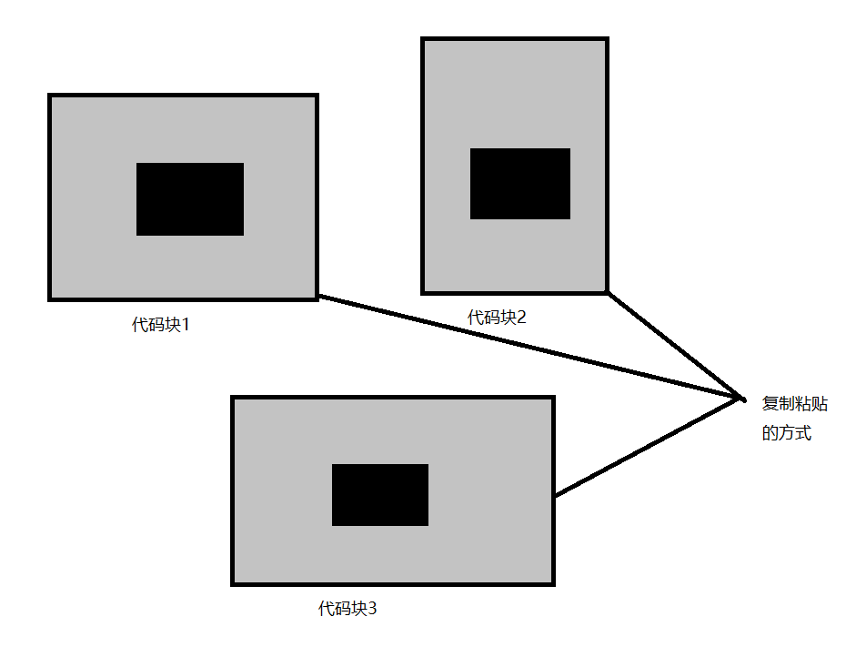
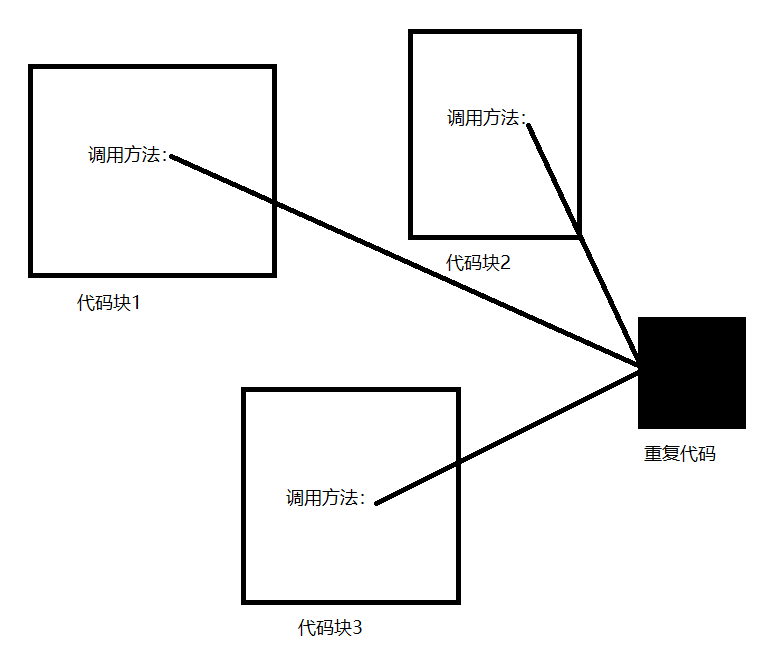

> Java06说明
>
> 为了覆盖更广的领域，我们分别设置了Java06A、Java06B两道顺序平行的题目供各位学习。两道题涉及领域不同，难度相比前面的题目更大，内容更多，大家可以先选择自己感兴趣的一道题研究，然后再尝试另外一道。建议有能力和充足时间的同学都尝试看看，**做不完也不勉强，提交到完成的位置即可（可以做完一个Task就提交一个Task）**。


> 难度系数：普通
>
> 不知道大家有没有听说过用java实现的框架？框架的底层实现通常都离不开**反射与注解**，让我们走进java更深的世界，做一点自己的小成品吧！
>
> （本题的知识点可能显得有点深入，但当你想开发出更多基础的、灵活性更强的代码时，本题所涉及到的反射与注解可以为你提供很多帮助）

# java方向-06A：想要做一点自己的小东西吗？🖮

## Task 1：注解与反射基础
### 1. 注解

> 在java程序中看到一个可爱的@，你应该也很想认识一下它吧

1. 试用感受一下现在常用的注解，比如Lombok和junit
2. 了解一下标记注解与元数据注解，了解一下java.lang.annotation包下的元注解，尝试自定义一个注解@MyTag要求：
   - 使该注解只能修饰类、接口或枚举定义
   - 使该注解在运行java程序时，JVM也可获取到注解信息
   - 有两个注解属性，String类型的name和int类型的age，其中要求name的默认值为"Node"，age的默认值为1


### 2. 反射

> 如何让程序只依靠运行时的信息就得到一个对象和类的真实信息呢？让我们一起来看看反射吧

下面定义一个微光工作室类🏠️，请完成以下要求：

```java
@MyTag
public class Glimmer
{
    private String location;      //工作室地点
    private int memberNum;        //工作室人数
}
```

- 通过**2种**方式得到这个Class对象（根据字符串获取，调用某个类的class属性）
- 获取该Class对象所对应类的注解，并打印出来
- 使用默认无参构造器创建一个Glimmer类的实例
- 假如Glimmer类提供了setter方法，请通过反射调用该实例的setter方法的方式设置这2个成员变量的值
- 假如Glimmer类没有提供setter方法，请通过直接访问成员变量值的方式设置这2个成员变量的值

使得最终打印这个实例，可得到如下结果：


## Task 2：反射的小应用

1. 首先，不知道你之前是否了解过java的一些设计模式，接下来我们将感受一下用反射生成JDK的动态代理模式。
2. 引入：有很多时候，我们会遇到相同代码段重复的情况
   - 最原始的解决方法是这样：但是这样代码耦合度太高🧶，如果要修改共同代码的话会很麻烦
   
     
   
   - 然后又有了这样的改进方法：但是这样的话，三个代码块又和一个特定方法耦合了

     
   
   - 而最好的情况应该是：三个代码块既可以执行重复代码的内容，又不用以硬编码方式直接调用重复代码方法，这个时候，就可以试试动态代理啦！
   
- 一个小场景的应用：


> 开学季，各大工作室都在招新，都希望学校帮忙宣传一下
首先定义一个Recruit接口表示招募

```java
public interface Recruit {
    public void advertise();          //宣传
    public void recruit();            //招募
}
```

学校的工作室类实现了这个接口
```java
public class Studio implements Recruit
{
    @Override
    public void advertise() {
        System.out.println("各工作室招新宣讲会来啦！！");
    }

    @Override
    public void recruit() {
        System.out.println("各工作室招新题发布！！");
    }
}
```

定义一个进行宣传的学校类📣，并实现它的主方法

```java
public class School
{
    public static void main(String[] args) {
        Studio studio = new Studio();
        studio.advertise();
        studio.recruit();
    }
}
```

> 作为微光工作室死忠粉的Node🥰💓，想悄悄为微光工作室修改一下上述代码，使执行每一个Studio类的方法时，都能在最后执行一下他的advice()方法

定义Node类如下：

```java
public class Node
{
    public void advice(){
        System.out.println("我要加入微光工作室(");
    }
}
```

最简单的修改方式如下，但Node觉得增加两次node.advice()也很麻烦

```java
public class Studio implements Recruit
{
    Node node = new Node();
    @Override
    public void advertise() {
        System.out.println("各工作室招新宣讲会来啦！！");
        node.advice();
    }

    @Override
    public void recruit() {
        System.out.println("各工作室招新题发布！！");
        node.advice();
    }
}
```

- 要求：请你使用动态代理的模式，推翻修改上述代码，使node.advice()只需要被增加一次	（Tips：可让School类作代理实现InvocationHandler接口，再增加一个新的类实现主方法）


## Task 3：写一个简单的IOC

- 引入：不知道你是否听说过IOC容器？没有听说过也没关系，你可以先看看这篇博文：[浅谈IOC--说清楚IOC是什么](https://blog.csdn.net/ivan820819/article/details/79744797?ops_request_misc={"request_id"%3A"165854165416781685374364"%2C"scm"%3A"20140713.130102334.."}&request_id=165854165416781685374364&biz_id=0&utm_medium=distribute.pc_search_result.none-task-blog-2~all~top_positive~default-1-79744797-null-null.142)

	>也就是说，之前所有由程序进行控制创建，new出来的对象 ，现在都可以由我们自行控制创建，我们把类与类之间的依赖关系提前在xml配置文件中写好，之后需要哪个对象直接取出来就好，这就把主动权交给了调用者。

- 要求：用IOC的设计思想，模拟实现一个IOC容器

首先定义两个注解：
@Component表示用IOC容器管理这个类，@Bean 表示这是一个bean（bean表示由IOC容器实例化、组装和管理的对象）
然后定义一个IOC容器操作接口：

```java
public interface BeanFactory {
    Object getBean(String str);
}
```
测试类如下，用getGlimmer()方法模拟取出bean对象的过程
```java
@Component
public class Glimmer {
    private String location;      //工作室地点
    private int memberNum;        //工作室人数
    
    @Bean("glimmer")
    public Glimmer getGlimmer() {
        return new Glimmer("三教401",41);
    }
    
    //...略去构造器等，以下代码也默认略去
}
```
在测试主方法中实现如下代码时，能显示出如下结果：
```java
public class Main {
    public static void main(String[] args) {
        //...省略一点实现
        Glimmer glimmer = (Glimmer) beanFactory.getBean("glimmer");//beanFactory为BeanFactory实现类的实例
        System.out.println(glimmmer);
    }
}
```


## Task 4：用xml再试试？

- 在Task 4 上更进一步，通过读取**xml**文件的方式获取bean的信息

	假如有测试类A,B

```java
public class A {
    private String str;
    private int num;
}
```

```java
public class B {
    private A refA;
}
```

通过以下applicationContext.xml文件来赋上属性

```xml
<?xml version="1.0" encoding="UTF-8"?>
<beans>
  <bean name="A" class="(包名随意).A">
    <property name="str" value="微光工作室"/>
    <property name="num" value="1"/>
  </bean>
  
  <bean name="B" class="(包名随意).B">
    <property name="refA" ref="A"/>
  </bean>
</beans>
```

用自己的测试类打印A,B的两个实例时，显示成功赋值输出


## 需要掌握的知识点	
- java反射与注解的基础与深入应用
- 一些设计模式
- 理解IOC
- 了解简单的xml文件格式


## Tips
- 如何扫描（比如扫描一个包下的类）？你可以看看Reflections类
- 如何解析xml文件？可以用用dom4j
- 如何对Bean对象进行操作？了解一些BeanUtils吧
- 需要使用第三方库？试试Maven or Gradle 吧
- 善用搜索引擎！！！！！！！


## 回答要求

- 本题不需要所有Task都做出再提交，可做完一个Task就提交一个Task
- 对于需要编程实现的**Task**，请提交能够运行的演示代码
- 完成本题过程中你遇到了什么困难，你是怎么解决的？

## 本题提交方式
> 收件邮箱：[glimmer401@outlook.com](mailto:glimmer401@outlook.com)
> 
> 主题格式：学号-姓名-考核-Java-06A
> 
> 主题示例：202209090101-大佬-考核-Java-06A

## 出题者Q&A方式
> QQ：1216754835
> 
> 邮箱：[1216754835@qq.com](mailto:1216754835@qq.com)

