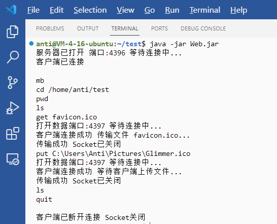

# Java方向-06B：网络编程
> Java06说明
>
> 为了覆盖更广的领域，我们分别设置了Java06A、Java06B两道顺序平行的题目供各位学习。两道题涉及领域不同，难度相比前面的题目更大，内容更多，大家可以先选择自己感兴趣的一道题研究，然后再尝试另外一道。建议有能力和充足时间的同学都尝试看看，做不完也不勉强，提交到完成的位置即可。


> `难度系数`：普通
>
> **现在我们的日常生活很难离开网络，从日常交流的QQ到公交上的外放抖音，网络应用充斥着我们的生活。接下来，我们将要利用Java开发一个简单的网络应用**


## Task1：一些准备

-  了解TCP/IP协议是什么 
-  Java中有一个叫做`InetAddress`的类，可以获取指定主机的信息。 
   -  尝试运行以下代码,理解主机名、域名和ip的联系与不同 


```java
import java.net.InetAddress;

public class Inet {
    public static void main(String[] args) throws Exception{
        InetAddress address = InetAddress.getLocalHost();
        System.out.println(address);
        address=InetAddress.getByName("glimmer.space");
        System.out.println(address);
    }
}
```


-  通过URL，我们可以获取各种网络上的资源🔗。 
   -  Java提供了`java.net.URL`类，通过它，我们可以研究🔎URL构造。 
   -  尝试运行以下代码，分析URL包含了哪些信息。 


```java
import java.net.MalformedURLException;
import java.net.URL;

public class LookURL {

    public static void main(String[] args)  {
            try {
                URL url = new URL("https://www.bilibili.com/video/BV1nU4y1i7Lt?share_source=copy_web");
                System.out.println(url.getProtocol());
                System.out.println(url.getAuthority());
                System.out.println(url.getFile());
                System.out.println(url.getHost());
                System.out.println(url.getPath());
                System.out.println(url.getPort());
                System.out.println(url.getDefaultPort());
                System.out.println(url.getQuery());
                System.out.println(url.getRef());
            } catch (MalformedURLException e) {
                throw new RuntimeException(e);
            }
    }
}
```


## TASK2：简单的Socket编程

-  通过Socket，我们可以方便地进行网络通信。 
-  尝试通过客户端-服务器结构编写一个程序。实现**客户端和服务器互相发送文本信息**并读取。 
-  通过这一步，我们可以了解： 
   -  如何创建Socket对象并建立连接。 
   -  Socket基本的I/O方法 

## TASK3: 文件传输

-  接下来，我们将要利用Socket写一个功能简单的远程文件传输工具。 
-  功能描述： 
   -  客户端和服务器需要建立两个Socket连接（命令端口和数据端口）。命令端口用于客户端向服务器发送命令，数据端口用于上传或下载文件，每次传输开始时打开，传输完毕后关闭。 
   - 客户端每行以`>>>`开始，提示用户输入。
   - 服务器会显示接收到的指令（可以尝试输出到一个日志文件中）。
   -  你需要实现以下指令  


| 指令 | 含义 |
| --- | --- |
| pwd | 显示远程工作目录 |
| cd | 改变远程工作目录 |
| ls | 显示远程工作目录包含的文件名 |
| get | 下载指定文件 |
| put | 上传指定文件 |
| quit | 关闭连接并退出程序 |


- 客户端示例：


- 服务器示例：



---

## 拓展部分

-  尝试利用并发编程，实现同时建立多个连接。 
-  尝试加上以下功能： 
   -  mkdir 建立远程目录 
   -  delete 删除单个文件 
   -  help 显示你实现的功能和用法 
   -  mput/mget 传输多个文件，允许使用通配符 
-  通过IO多路复用，实现文件传输的暂停、继续和取消。 

## 需要掌握的知识点

- IP、端口等网络术语的含义。
- Socket的建立与使用
- Java的IO方法

## Tips

- 多进行动手尝试。
- 逐步完成功能。
- 如果出现不能连接的问题，尝试检查你的防火墙
- 如果文件不能传输，尝试检查进程权限

## 回答要求

-  本题不需要所有Task都做出再提交，可做完一个Task就提交一个Task
-  建议通过截图加文字的过程，记录如何学习相关知识，以及自己用到了哪些知识点，具体体现在哪里。 
-  做了Task2或Task3的同学，请截取核心部分代码在文档中并进行介绍。 
-  Task2&Task3的代码请上传至Github仓库并提供链接。 
-  代码要求 
   -  Task2的代码放在`glimmer.(你的id).echo`包中,Task3的代码放在`glimmer.(你的id).ftp`中 
   -  代码尽量遵守命名规范，做到其他人能够看懂，尽量不要用_fxxk_等词😥 
   -  做到注释规范，在命令处理、文件传输等模块写好简洁、明了的注释。 
   -  在README中，包含以下信息 
      - 给你自己的项目命名一个好听的名字，以及简单的介绍
      - 介绍项目运行的环境
      - 列出你的项目实现了哪些功能，哪些功能想实现还没有实现。
      - 提供项目用法， 如何让其他人也能够使用。
      - 使用的示例，你可以用文字+代码＋截图（＋GIF)演示如何使用你的项目。
      - 更新文档，如果你不是一次性完成这个项目，你可以每次记录一下自己加了什么功能，或者修复了什么bug。
      - License
      - 支持 提供你的联系方式,比如电子邮件和QQ
      - (以上内容也可以加进回答的文档)

## 提交方式

> 收件邮箱：[glimmer401@outlook.com](mailto:glimmer401@outlook.com)
>  
> 主题格式：学号-姓名-考核-Java-06B
>  
> 主题示例：2022090901012-大佬-考核-Java-06B


## 出题者Q&A方式

> QQ：1219935161
>  
> 邮箱：antio2[@qq.com ](/qq.com ) 

